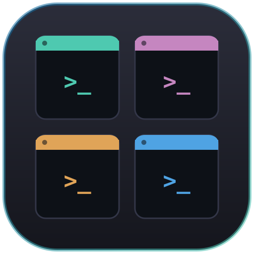
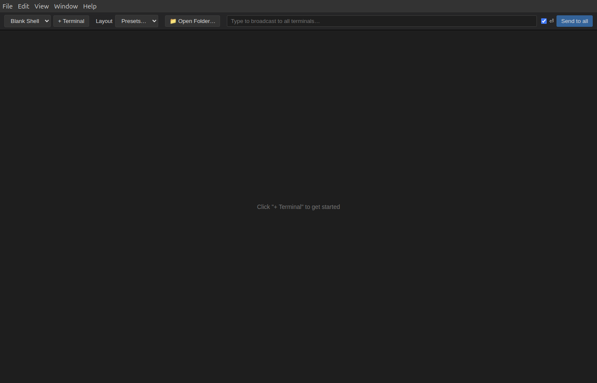
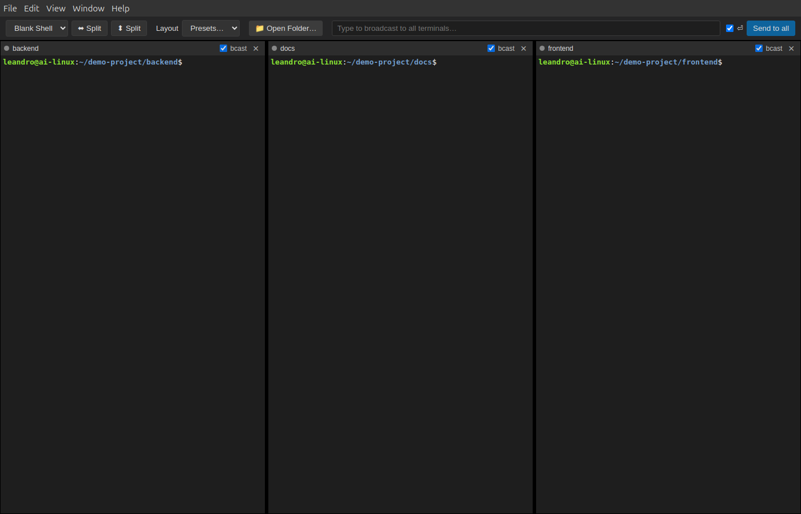
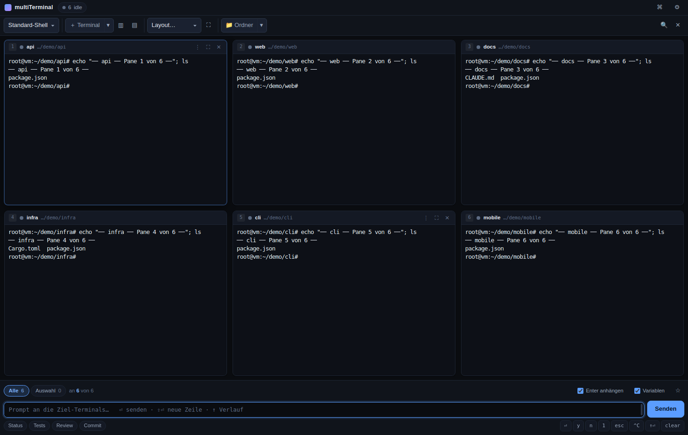

# multiTerminal

A desktop app for opening a grid of real terminals in one window — split them like tmux, launch panes from reusable templates, and broadcast the same input to all of them at once.

Built with Electron, [`node-pty`](https://github.com/microsoft/node-pty) (real PTYs, so `cd`, vim, and interactive programs all work normally), and [`xterm.js`](https://github.com/xtermjs/xterm.js).



## Screenshots

| | |
|---|---|
|  |  |
| Toolbar: templates, split, layout presets, Open Folder, broadcast | **Open Folder…** — one terminal per subfolder, auto-arranged and `cd`'d in |


*Broadcast — the same command typed once, executed in every pane, each showing its own output*

## Features

- **Resizable split-pane grid** — add terminals and split them side-by-side (⬌) or stacked (⬍); drag dividers to resize. Panes host fully functional shells via `node-pty`.
- **Templates** — JSON files in `templates/` define reusable pane presets (`name`, `command`, `args`, `cwd`, `env`, `color`). Pick one from the toolbar dropdown before adding/splitting a pane. Ships with a `Blank Shell` default and an example `omp` template you can point at your own tool.
- **Layout presets** — instantly arrange the grid into fixed sizes from 1x1 up to 4x6.
- **Open Folder…** — pick one or more folders in the dialog (Ctrl/Shift-click, or Ctrl+A to select everything in a directory) and each becomes its own terminal, already `cd`'d in. One folder selected → one terminal; several → one per folder, auto-arranged in a near-square grid (e.g. 3 folders → one row of 3 at 33% each; 5 folders → a balanced 3-then-2 layout). Files selected in the dialog are ignored.
- **Broadcast input** — type into the top bar and hit "Send to all" (or Enter) to write the same keystrokes into every terminal's PTY at once, with an optional trailing Enter so it executes everywhere simultaneously. Each pane has a "bcast" checkbox to opt out individually.
- **Copy** — select text and either right-click (copies the selection) or press `Ctrl+Shift+C`. Paste works with the normal `Ctrl+V`.
- **Per-pane controls** — close, rename via template, and toggle broadcast inclusion per terminal.

## Requirements

- Node.js and npm
- Build tools for the `node-pty` native addon: `python3`, `make`, `g++` (already required by most dev machines)

## Getting started

Quick install (Linux/GNOME) — installs dependencies and adds an app-grid/dock launcher with icon:

```bash
./install.sh
```

Or just run it without installing a launcher:

```bash
npm install
npm start
```

On Linux, `npm start` runs Electron with `--no-sandbox`. This is needed unless your system's `node_modules/electron/dist/chrome-sandbox` binary is owned by `root` with the setuid bit (`chmod 4755`) — most dev machines aren't set up that way, so the flag is the simpler path for local use.

## Templates

Add a `.json` file to `templates/` to make it selectable from the toolbar dropdown:

```json
{
  "name": "omp",
  "command": "omp",
  "args": [],
  "cwd": "~",
  "color": "#C586C0",
  "env": {}
}
```

- `command`/`args` — what to launch in the pane (defaults to your `$SHELL`)
- `cwd` — starting directory (`~` expands to your home directory)
- `color` — accent color shown in the pane header
- `env` — extra environment variables merged into the pane's process

A common workflow: create a template for a CLI tool (e.g. an AI assistant you can pick a different model in per-terminal), open several panes from it, configure each manually, then use **Broadcast** to send the same prompt into all of them at once.

## Desktop integration (Linux/GNOME)

`./install.sh` runs `npm install` and generates `~/.local/share/applications/multiterminal.desktop`, pointing at this repo's `node_modules/electron` binary and using `build/icon.png` as the icon. After running it, multiTerminal shows up in your application grid — right-click it there and choose "Add to Favorites" (or "Pin to Dash") to add it to the dock.

The script is idempotent, so re-running it after `git pull` (e.g. to pick up dependency updates) is safe.
